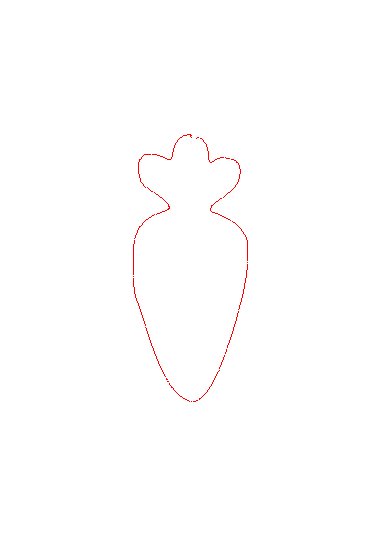

# Drawing Robot with OMX

A comprehensive tutorial and implementation for controlling a ROBOTIS OMX robot to perform drawing tasks in both simulation and real-world environments using MuJoCo.

## Table of Contents
- [Features](#features)
- [Before You Start](#before-you-start)
- [Installation](#installation)
- [Usage](#usage)
- [Major Modifications in OMX-MJCF](#major-modifications-in-omx-mjcf)
- [Results](#results)
- [Acknowledgements](#acknowledgements)

## Features

- 🎨 Draw custom images using the OMX robotic arm
- 🔄 Seamless simulation-to-real transfer
- 📐 Path planning and trajectory optimization
- 🖼️ Image preprocessing and contour extraction
- ⚙️ Full MuJoCo physics simulation support

## Before You Start

We use a pen asset from [Thingiverse](https://www.thingiverse.com/thing:4087741).  
However, since this asset does not include an explicit license or copyright notice, we recommend that you either download the model yourself or use a different asset suitable for your own pen design.

Download (or create) your pen asset and save it in the [omx asset directory](./asset/omx/) as `touch_pen.stl`.

## Installation

### Requirements

```
cvxpy==1.6.2
dynamixel_sdk==3.7.31
glfw==2.8.0
ipython==8.12.3
ipykernel==7.1.0
matplotlib==3.10.7
mujoco==3.3.2
numpy>=1.24.4
opencv-python==4.12.0.88
Pillow==11.2.1
PyAutoGUI==0.9.54
PyOpenGL==3.1.10
PyOpenGL-accelerate==3.1.10
PyQt5==5.15.11
PyQt5_sip>=12.15
scipy>=1.11.0
Shapely==2.1.0
termcolor==3.1.0
tqdm==4.67.1
```

### Setup

Install all dependencies using:

```bash
pip install -r requirements.txt
```

## Usage

The main code is provided in [drawing_omx.ipynb](./notebook/drawing/drawing_omx.ipynb).

### Running in Simulation

1. Open the notebook in Jupyter:

   ```bash
   jupyter notebook notebook/drawing/drawing_omx.ipynb
   ```

2. Follow the notebook cells to:
   - Load and preprocess your input image
   - Generate drawing paths from contours
   - Simulate the drawing process in MuJoCo
   - Visualize the results

### Running on Real Robot

1. Connect your OMX robot via USB
2. Configure the Dynamixel SDK port settings in the notebook
3. Run the same notebook with real robot mode enabled
4. The robot will execute the same trajectories tested in simulation

## Major Modifications in OMX-MJCF

The MuJoCo XML file is located at [omx_f_drawing.xml](./asset/omx/omx_f_drawing.xml).

The pen model is fixed directly in this XML file.
If you'd like to extend the project with pick-and-place functionality, you can remove the pen from this XML, create a separate MJCF file for the pen, and add it to [scene_omx_f_drawing.xml](./asset/omx/scene_omx_f_drawing.xml).

## Results

<table>
  <tr>
    <th>Input</th>
    <th>Output</th>
  </tr>
  <tr>
    <td></td>
    <td></td>
  </tr>
</table>

<table>
  <tr>
    <th>Drawing (Simulation)</th>
    <th>Drawing (Real)</th>
  </tr>
  <tr>
    <td></td>
    <td>
       <video src="https://github.com/user-attachments/assets/a7076d40-5f23-46d2-8909-c9195b8c908d" width="400" autoplay loop muted></video>
      </a>
    </td>
  </tr>
</table>


## Acknowledgements

- This code is mainly adapted from [Drawing-Robot-with-Openmanipulator-X](https://github.com/EndeavoringYoon/Drawing-Robot-with-OpenManipulator-X)
- The robot asset for ROBOTIS OMX is from [robotis_open_manipulator](https://github.com/ROBOTIS-GIT/open_manipulator/tree/main/open_manipulator_description/urdf/omx_f)
- The [mujoco_helper](./package/mujoco_helper), [kinematics_helper](./package/kinematics_helper/), and [utility](./package/utility/) packages are adapted and modified from [yet-another-mujoco-tutorial](https://github.com/sjchoi86/yet-another-mujoco-tutorial-v3)
- The [openmanipulator](./package/openmanipulator) package is based on [DynamixelSDK](https://github.com/ROBOTIS-GIT/DynamixelSDK)
